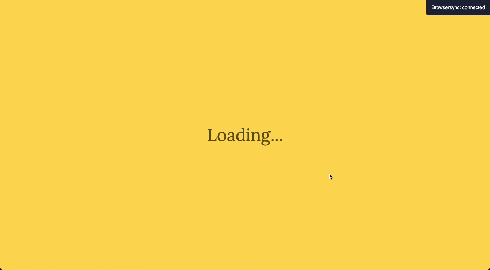
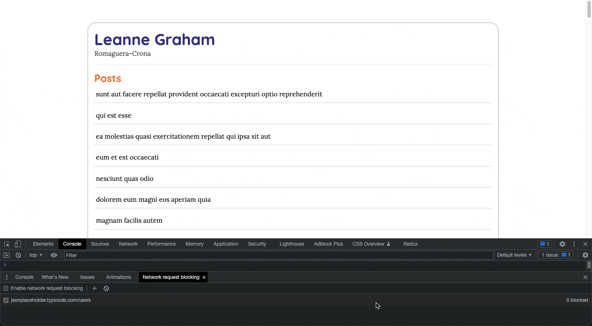

## Project running



## Install dependencies

```
npm i
```

## Run tests

```
npm run test
```

## Run tests with watch files

```
npm run test:watch
```

## Run in the browser

```
npm run start
```

## Handle error network


